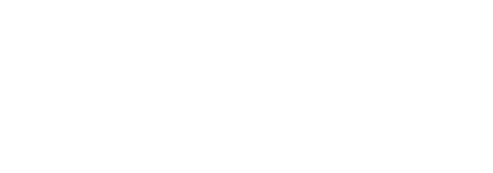
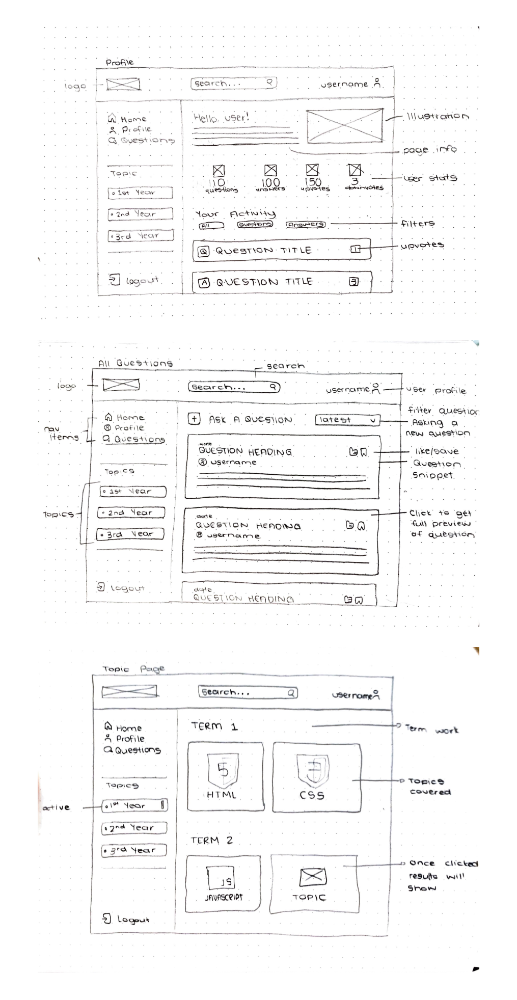
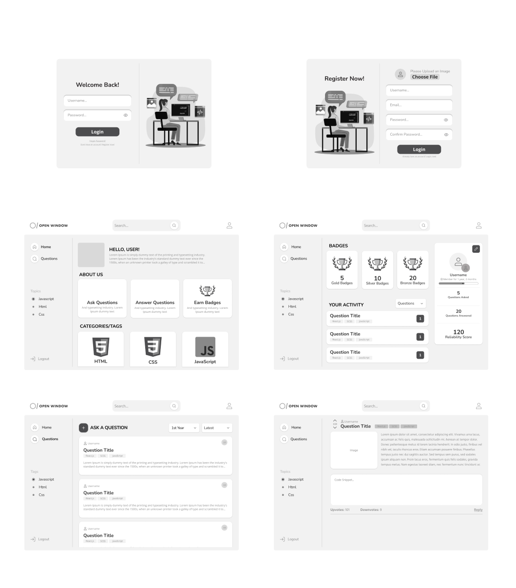
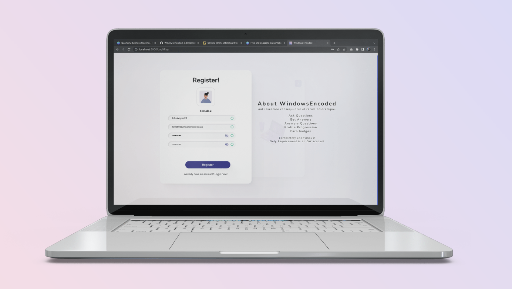
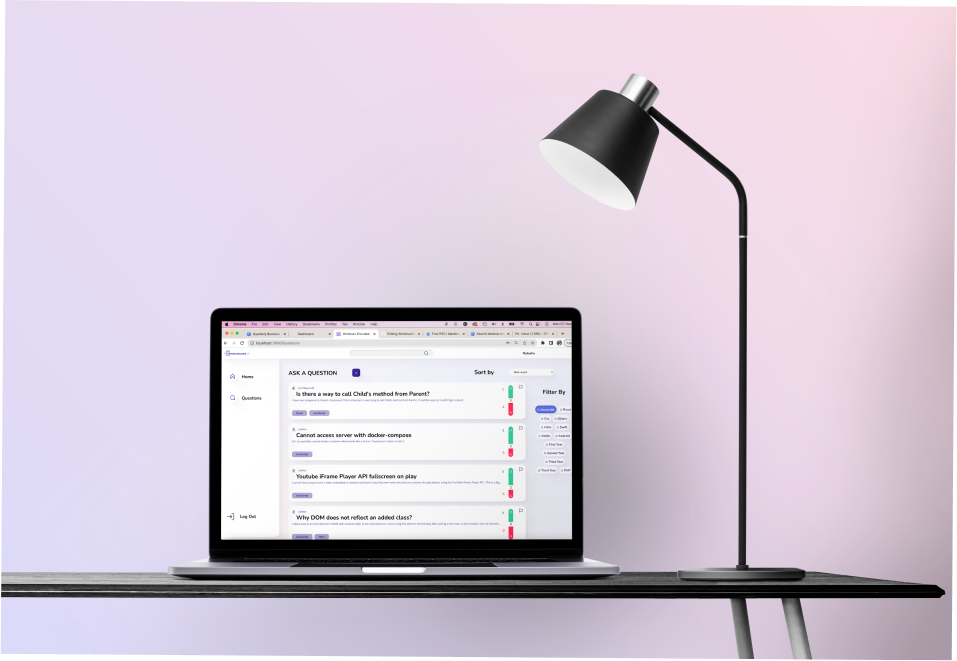
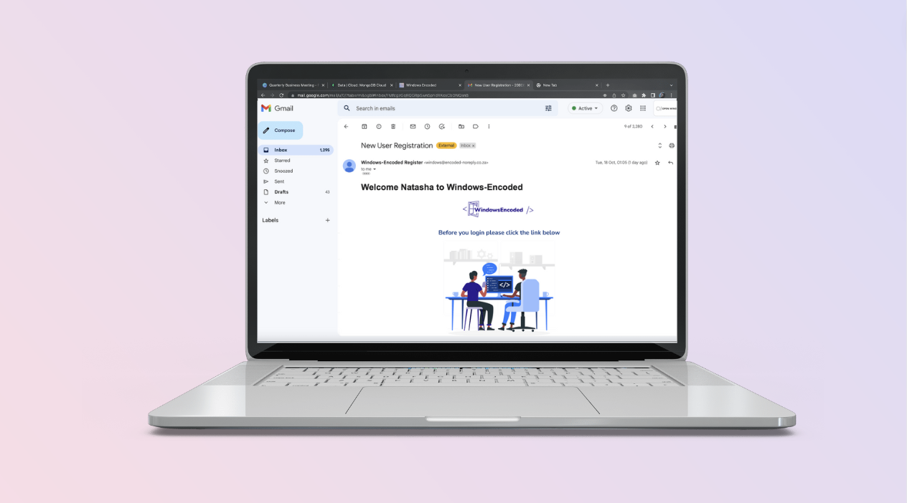

## Repo Info


Reinhardt de Beer
21100115 - DV_200_T3

# LIB - Development Term 3
<p align="center">
    
</p>

Utilising the MERN stack's other technologies, including Node.js, Express.js, and MongoDB Atlas. I implemented these technologies inside a mock e-commerce web application. Choosing lenses and accessories as my niche product and theming around that. From which the project LIB was designed and developed.

## Table of contents

* [Installation](#Installation)
* [Build With](#Build-With)
* [Features](#Features-and-Functions)
* [Development-Process](#Development-Process)
    * [Ideation](#Ideation)
    * [Wireframes](#Wireframes)
    * [Challenges](#Challenges)
    * [Challenges](#Above-And-Beyond)
    * [Challenges](#Future-Implementation)
* [Final-Outcome](#Final-Outcome)
    * [Mockups](#Mockups)
    * [Video-Demonstration](#Video-Demonstration)
    * [Final-Outcome](#Final-Outcome)
* [Authors](#Authors)
* [License](#License)
* [Contact](#Contact)
* [Acknowledgements](#Acknowledgements)

## Installation

1. GitHub Desktop </br>
Enter `https://github.com/EpicBlue1/Lib_ECommerce_Dev_T3.git` into the URL field and press the `Clone` button.

2. Clone Repository </br>
Run the following in the command-line to clone the project:
   ```sh
   git clone https://github.com/EpicBlue1/OOP_21100115_ReinhardtdeBeer.git
   ```
    Open `Software` and select `File | Open...` from the menu. Select cloned directory and press `Open` button

3. Install Dependencies </br>

Run the following in the command-line to install all the required dependencies inside the server and client folder:
   ```sh
   npm i
   ```

4. An API key is not required

## Build With

| Name              | Link                                                                     |
| ----------------- | ------------------------------------------------------------------------ |
| <p>Node Js</p> |  https://nodejs.org/ |
| <p>MongoDB</p> |  https://www.mongodb.com/ |
| <p>multer</p> |  https://github.com/expressjs/multer |
| <p>Bootstrap React</p> |  https://react-bootstrap.github.io/ |
| <p>Express</p> |  https://expressjs.com/ |

## Features and Functions

- Log In and Validation
- Individual Product pages
- Cart: add and remove
- Update, delete and add if admin on Inventory page
- Filter and sort on all products page
- An Image Slider on Landing page

## Development Process

### Ideation
[Pinterest Board For Concept](https://za.pinterest.com/debeer0072/dev_200-term-3/)

### Wireframes

Initial wireframes:
<p align="center">
    
</p>

Final wireframes:
<p align="center">
    
</p>

## Challenges

* Not focussing on the core functionality first.
* Server crashes (the result of a spelling mistake, the way I pass my data to the backend, and so on.)
* Keeping track of props ( I utilized a lot of props I kept losing track, a better alternative would be sessionstorage.)

## Above And Beyond

* Filter and sort on all product page
* UseReduser used to update and rerender components

## Future Implementation

* Complete individual page: add variations, make add to cart and quantity work.
* Complete checkout and its backend functionality
* Orders Page
* Search
* Add product qts together if same product

## Final Outcome

### Mockups

<p align="center">
    
    
    
    
    
</p>

## Video Demonstration

To see a run through of the application, click below:

[View Demonstration](https://youtu.be/DBMcaTIUYoc)

## Authors

* **Reinhardt de Beer** - [EpicBlue1](https://github.com/EpicBlue1)

## License

Distributed under the MIT License. See `LICENSE` for more information.

## Contact

* **Reinhardt de Beer** - [21100115@virtualwindow.co.za](mailto:21100115@virtualwindow.co.za) - [@rdb_fotopatat](https://www.instagram.com/rdb_fotopatat/) 
* **Project Link** - https://github.com/EpicBlue1/Lib_ECommerce_Dev_T3

## Acknowledgements

* **Contexts and useReducers** - [Leander van Aarde Github](https://github.com/LeandervanAarde)
 
